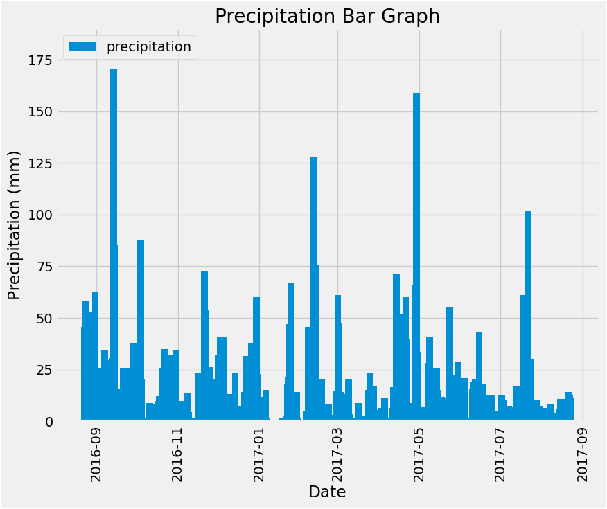
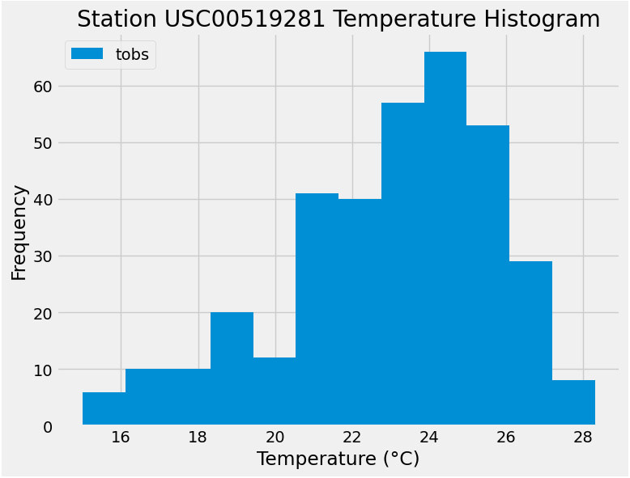

# Data-assignment-week10-sqlalchemy-challenge

## Part 1: Analyse and Explore the Climate Data

I was able to create the following graphs in my Jupyter notebook, please refer to climate_starter.ipynb file.

## Part 2: Design Your Climate App

Please refer to app.py file for code.

## References

Data-assignment-week10-sqlalchemy-challenge, Ask BCS Session with Siphe, personal communication (Zoom), March 3, 2024

Data-assignment-week10-sqlalchemy-challenge, Tutor Session with Sibusiso, personal communication (Zoom), March 2, 2024

OpenAI. (2024). ChatGPT (GPT-3.5 architecture.) [Computer software]. Retrieved March 2, 2024, from https://openai.com/chatgpt

University of Adelaide. (2023). Reflection Solution - Advanced SQL Activity. Retrieved from (https://git.bootcampcontent.com/University-of-Adelaide/UADEL-VIRT-DATA-PT-12-2023-U-LOLC/-/blob/main/10-Advanced-SQL/2/Activities/05-Ins_Reflection/Solved/reflection_solution.ipynb?ref_type=heads)

University of Adelaide. (2023). Flask with ORM App Solution - Advanced SQL Activity. Retrieved from (https://git.bootcampcontent.com/University-of-Adelaide/UADEL-VIRT-DATA-PT-12-2023-U-LOLC/-/blob/main/10-Advanced-SQL/3/Activities/10-Ins_Flask_with_ORM/Solved/app_solution.py?ref_type=heads)